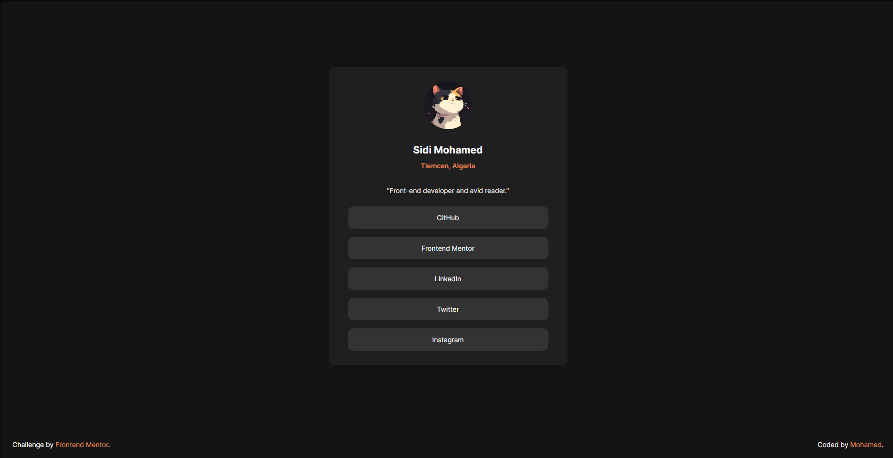

# Frontend Mentor - Social Links Profile Solution

This is a solution to the [Social links profile challenge on Frontend Mentor](https://www.frontendmentor.io/challenges/social-links-profile-DF32f0ZRV). Frontend Mentor challenges help you improve your coding skills by building realistic projects.

## Table of Contents

- [Overview](#overview)
  - [The Challenge](#the-challenge)
  - [Screenshot](#screenshot)
- [My Process](#my-process)
  - [Built With](#built-with)
  - [What I Learned](#what-I-learned)
- [Author](#author)

## Overview

### The Challenge

Users should be able to:
- See hover and focus states for all interactive elements on the page.
- View the optimal layout depending on their device's screen size (fully responsive for mobile and desktop).

### Screenshot

## Screenshot

## My Process

### Built With

- Semantic HTML5 markup
- CSS custom properties (Variables)
- Flexbox for layout alignment
- Mobile-first approach & custom media queries

### What I Learned

During the development of this project, I focused heavily on layout stability and responsive fine-tuning. Key takeaways include:
- Managing vertical space cleanly using explicit margins instead of rigid flex layouts where appropriate.
- Perfectly balancing card positioning and footer alignment on smaller mobile viewports.
- Utilizing CSS variables for maintaining a consistent, dark-themed design system.

## Author

- GitHub - [mo-ha-med-9](https://github.com/mo-ha-med-9)
- Frontend Mentor - [@mo-ha-med-9](https://www.frontendmentor.io/profile/mo-ha-med-9)
